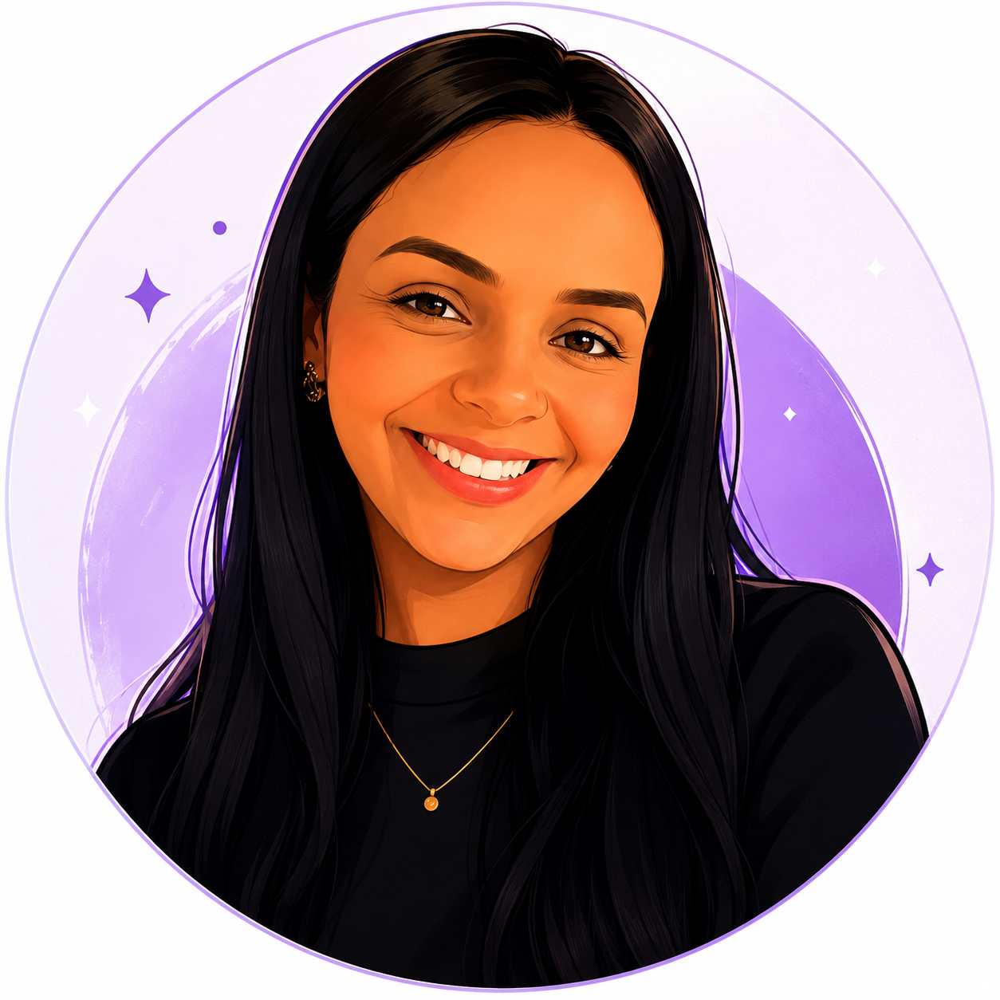
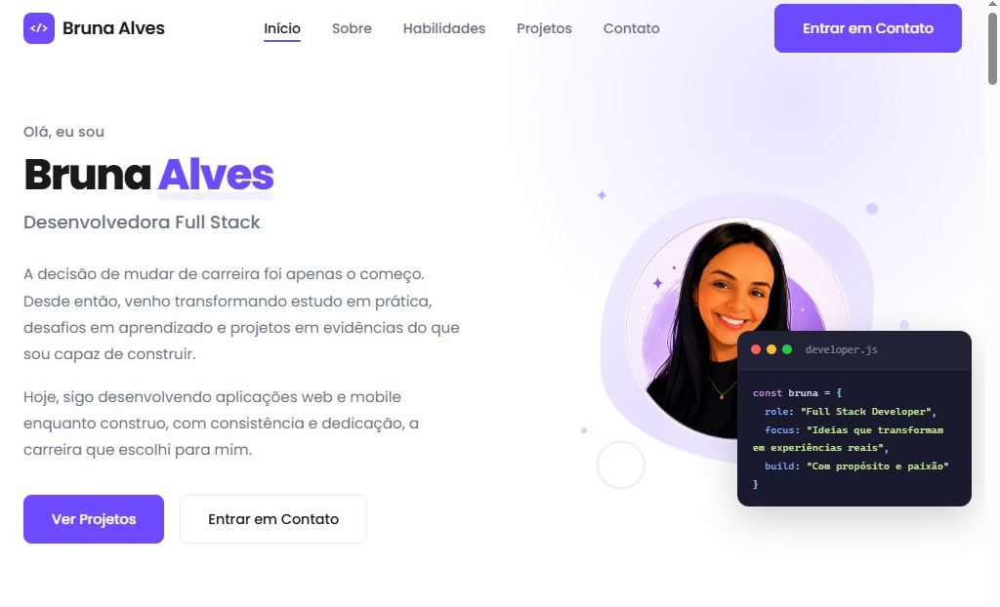
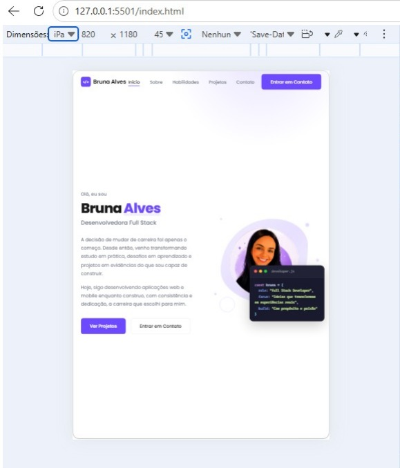
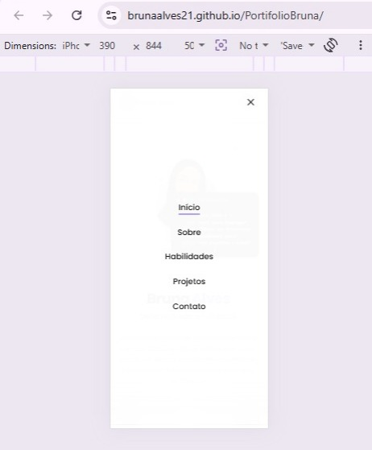

<div align="center">



# 💜 Bruna Alves — Portfólio

### Desenvolvedora Full Stack em transição de carreira, transformando curiosidade em código e construindo a carreira que escolhi para mim.

[](https://github.com/brunaalves21)
[](https://www.linkedin.com/in/bruna-maria-alves-036ba568)
[](https://brunaalves21.github.io/PortifolioBruna/)

---

*"Construindo minha carreira uma linha de código por vez."*

</div>

---

# 📋 Descrição

Este portfólio representa minha jornada na tecnologia: uma transição de carreira guiada pela curiosidade, disciplina e vontade de construir algo significativo.

Desenvolvido do zero utilizando apenas **HTML, CSS e JavaScript puros**, ele reúne projetos, habilidades e experiências que refletem meu crescimento como desenvolvedora Full Stack. Mais do que uma coleção de trabalhos, este projeto simboliza minha evolução técnica, minha atenção aos detalhes e a certeza de que nunca é tarde para recomeçar e construir novos caminhos.


# ✨ Funcionalidades

- ✅ Design totalmente responsivo (320px até 1920px)
- ✅ Navbar fixa com efeito Glassmorphism
- ✅ Hero Section com blob animado em CSS
- ✅ Card terminal flutuante com informações da desenvolvedora
- ✅ Menu mobile interativo
- ✅ Scroll suave entre as seções
- ✅ Destaque automático do link ativo da navegação
- ✅ Animações de entrada utilizando IntersectionObserver
- ✅ Microinterações e efeitos hover
- ✅ Formulário de contato funcional com validação JavaScript
- ✅ Integração com Formspree
- ✅ HTML semântico e código organizado
- ✅ Estrutura preparada para futura implementação de Dark Mode

---

# 🛠️ Tecnologias Utilizadas

| Tecnologia | Finalidade |
|---|---|
| HTML5 | Estrutura semântica |
| CSS3 | Estilização, Grid, Flexbox, responsividade e animações |
| JavaScript (Vanilla) | Interatividade e manipulação do DOM |
| Formspree | Envio do formulário de contato |
| Google Fonts | Tipografia Poppins |
| Git & GitHub | Controle de versão |
| GitHub Pages | Deploy da aplicação |

---

# 🚀 Status do Projeto

## ✅ Em constante evolução.

Assim como minha trajetória na tecnologia, este portfólio continuará recebendo melhorias, novos projetos e aprendizados ao longo da minha carreira.

---

# 📂 Estrutura do Projeto

```text
PortifolioBruna/
├── css/
│   ├── style.css
│   └── assets/
│       └── profile.jpg
├── js/
│   └── script.js
├── index.html
└── README.md
```

---

# ▶️ Como executar localmente

### 1. Clone o repositório

```bash
git clone https://github.com/brunaalves21/PortifolioBruna.git
```

### 2. Entre na pasta do projeto

```bash
cd PortifolioBruna
```

### 3. Execute o projeto

Você pode:

- Abrir o arquivo `index.html` diretamente no navegador;

ou

- Utilizar a extensão **Live Server** no VS Code para uma melhor experiência durante o desenvolvimento.

---

# 📬 Configurando o Formspree (Opcional)

Caso queira utilizar seu próprio formulário:

Localize a tag `<form>` no arquivo `index.html` e substitua o atributo `action` pelo seu endpoint do Formspree.

Exemplo:

```html
<form
  class="contact__form"
  id="contact-form"
  action="https://formspree.io/f/SEU-ID"
  method="POST"
  novalidate
>
```

Crie gratuitamente sua conta em:

https://formspree.io

---

# 💭 Sobre este projeto

Este foi um dos primeiros projetos que desenvolvi inteiramente do zero utilizando tecnologias nativas da web.

Além do código, ele representa minha evolução técnica, minha dedicação aos estudos e minha capacidade de aprender, adaptar e persistir diante dos desafios. Cada detalhe deste portfólio foi pensado para transmitir quem eu sou hoje e quem estou me tornando como profissional da tecnologia.

---

# 📸 Prints do Projeto

| Desktop | Tablet | Mobile |
|---|---|---|
|  |  |  |

---

# 🔗 Links

### 📁 Repositório

https://github.com/brunaalves21/PortifolioBruna

### 🌐 Aplicação Online

https://brunaalves21.github.io/PortifolioBruna/

### 🎨 Protótipo no Figma

https://www.figma.com/make/zz6gDMa1uEB9E9PQEyeF1n/Redesign-de-Portf%C3%B3lio-Pessoal?fullscreen=1&t=ngrGsHWOrJp8tWqx-1&code-node-id=0-9

---

# 📬 Contato

- GitHub: https://github.com/brunaalves21
- LinkedIn: https://www.linkedin.com/in/bruna-maria-alves-036ba568
- E-mail: brunaalves2107@gmail.com

---

<div align="center">

### ☕ Feito com muito café, curiosidade e coragem para recomeçar quantas vezes fossem necessárias.

**Bruna Alves • 2026**

</div>
